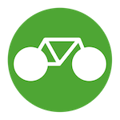

# Android project : BikeTracks

*October 2017 - January 2018*

Authors
- Antoine Drabble <antoine.drabble@master.hes-so.ch>
- Damien Rochat <damien.rochat@master.hes-so.ch>
- Sébastien Richoz <sebastien.richoz@master.hes-so.ch>

## Introduction

The goal of this project is to develop an Android mobile application. The project is developed in Java and is called "BikeTracks".

This application let users discover mountain bike tracks by exploring them on a map and gives the following details on each track : the track itself drawn on the map, the altimetry profile and distance.

In addition, they would also be able to start their own mountain bike activity, tracked by the location of their smartphone letting them know if they are following or not the desired track. Typical data is also exposed like distance, time, current elevation, cumulate elevation and so on.

If the biker has any problem, an emergency call button will let him send his location to his predefined secure contacts.

All tracks are locally registered in the smartphone and users are able to consult them any time. They also may be shared with users' contacts (by email or another messaging app).

This project was realised by Damien Rochat, Sébastien Richoz et Antoine Drabble as part of the "Mobile operating systems and applications" courses at the MSE, HES-SO. It is supervised by the professor Pascal Bruegger. It was realised between october 2017 and january 2018.

### Code management and conventions

All of the code was developed and versioned using Github on the following repository: https://github.com/damienrochat/BikeTracks.
We have followed the course recommendations on Android. We followed the coding style conventions of the Django Framework for the REST API https://docs.djangoproject.com/en/dev/internals/contributing/writing-code/coding-style/.

### Development phases

The development of the application was split in 6 phases.

1. Determination of the functionalities
2. Creation of a mock-up of the application
3. Set up of the application and its dependencies
4. Creation of the activities layouts and creation of the backend in parallel
5. Development of the functionalities on the Android application
6. Beta tests and bug fixes

The documentation was written along all of these phases.

### Functionalities

Here is the list of functionnalities that have been realised in this project.

- Show the bike tracks on a map in a radius R around a point P (the location is defined by the cyclist).
- Creation of a REST API for the retrieval of tracks
- Recording of an activity. The position of the cyclist if shown in real time on the map as well as the available tracks so that he can follow one. The cyclist can also save an activity where there is no track.
- Display of the historic of activities recorded by the cyclist.
- Detail on an activity. Visualisation of the track on a map with statistics such as duration, distance, average speed, altimetric profile, ...
- Sending of an SMS alert in case of an accident. The cyclist triggers the alert by clicking on a button and the alert is sent to the list of close people he has set along with his current position.

### Similar applications

There are many similar application available on Android:

- Runtastic Road Bike Cyclisme
- Cyclisme
- MapMyRide
- Komoot
- Strava
- TrailForks
- ViewRanger
- Bike routes
- Bikemap

Some of these application support recording and visualizing your own tracks. Some others let users research for tracks on a map. But few allow both functionalities.

Some of these applications also require payment to gain access to all the functionalities and most of them lack many tracks in Switzerland.

## Conception

A lot of time was spent for the conception phase to make the application work in the most efficient way possible. We were aware that a track may contain a lot of points which may result in a bad user experience as it could take a long time to display all the tracks on the map.

We wanted also the user to understand the app easily by limiting the number of Android activities and the different screens and layout displayed to him.

### Architecture

The architecture of this application is simple. On the client side, the application needs a service to record an activity and a local database to store the recorded activity and the emergency contacts. On the server side, an optimized server is needed to retrieve the tracks from a given area in an efficient manner.

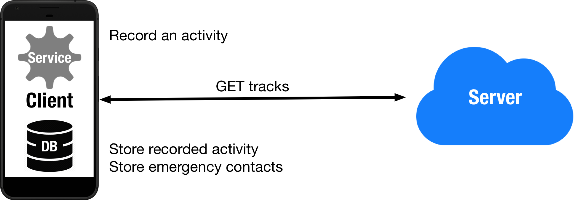

As this is an Android lesson, we'll try to focus more on the client but to understand the whole structure, it is necessary to explain how the server was build.

### Mock-ups
The mock-ups shows the expected views for the mobile application. It helps us visualize it as a whole and organize ourselves.


To improve user experience we focused on recording an activity on the same view as the one displaying the tracks. These tracks must also be differentiable by high contrasting colors to distinguish superimposed tracks.

## Development

The development phase explains how the architecture was build, considering server (backend) and client side (frontend).

### Backend

The backend is a REST API which serves tracks over HTTPS. It uses the Django REST Framework to process HTTP requests and a PostgreSQL database to store and query the tracks using spatial information. The extension PostGIS is used to help operating geographical data like computing the centroid of a track.

Creating a specific backend was necessary as we couldn't find a suitless API doing the job for us. However, we found one named TrailForks which fitted the best our needs. The attempts to contact them remained unanswered, that's why we decided to create our own.

#### Technologies

##### Python

Python is a popular interpreted programming language.


##### Django

Django is a big web Framework in Python.


##### Django REST Framework

Django REST framework is a powerful and flexible toolkit for building Web APIs with Django.


##### PostgreSQL

PostgreSQL is a crossplateform relational database management system.


##### PostGIS

PostGIS provides geographic and geometric types and functions for the PostgreSQL database, allowing storage and query of information about location.


Django natively includes an Active Record ORM and an extension allowing to use it with geospacial databases. It's called GeoDjango.

#### Database design

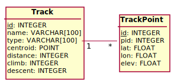

In order to be served by the API, all points of the tracks are kept in the database. They're stored with latitude, longitude (WGS84 format) and elevation fields. It doesn't use any PostGIS type, cause this entity is not queried.

The track entity contains precomputed distance, positive and negative elevation (climb and descent). This avoids recalculating for each request.
The centroid field use the `Point` PostGIS type. It's contains the coordinates of the center of the track, used for queries. It's also possible to make radius lookup on the whole track by querying a `LineString ` (path define by the sequence of points). It's more precise but less efficient.

#### API Endpoints

The API contains two endpoints to retrieve the tracks.
1. **GET /tracks?lat=X&lng=Y&radius=Z** : Retrieve the tracks in a given region defined by a circle:
    - Center [lat,lng] : The GPS coordinates corresponding to the center of the currently seen map on the smartphone.
    - Radius [m] : The diagonal of the screen divided by two.

    The following picture shows the area to look for the tracks. The red dot is the center of the map and the yellow line is the radius. The Google Map API helps us to retrieve easily these values.
    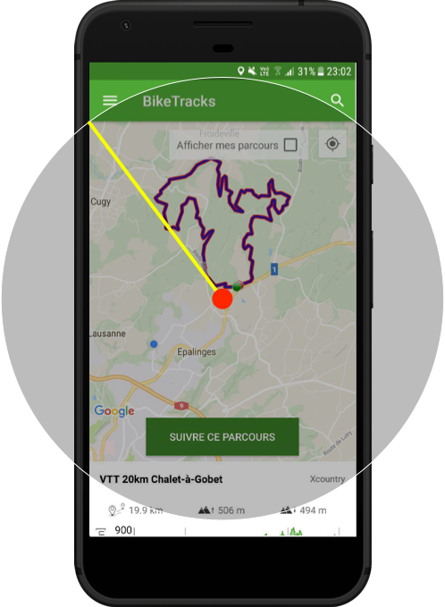

    If any centroid is contained it this circle, the corresponding track will be retrieved to the user. The biggest the radius is, the less point will be retrieved for each track to avoid overloading the bandwidth and obviously get the tracks faster. It doesn't impact the quality of the drawn path on the map as the user zooms out because he won't be able to distinguish so many points. A track may contain from 3600 (a 1 hour activity) up to 18'000 points (5 hours) if there are measured every second.

2. **GET /tracks/{id}** : Retrieve one track with all of its points. When a user focuses on a track, the whole details are needed.  

More information about the API : https://github.com/damienrochat/BikeTracks-API#api

#### Radius Query

The radius query use the PostGIS `ST_Distance(geography, geography)` function, enought in this case but limited to 2D points (elevation is not considered).

It's also possible to compare `geometry`. It's more efficient cause no trigonometric operations, but limited to the coordinate projection format used (for example limited to Europe). It also allow to query 3D points.
More information on the PostGIS documentation : https://postgis.net/docs/ST_Distance.html

#### Track file format

GPX track files could be used to fill the API. Here is an example of a .gpx file.

```xml
<?xml version="1.0" encoding="UTF-8"?>
<gpx xmlns="http://www.topografix.com/GPX/1/1" version="1.1" creator="Creator_name">
  <trk>
    <name>Name_of_the_track</name>
    <type>Downhill|Freeride|Enduro|Xcountry</type>
    <trkseg>
      <trkpt lat="46.78888733" lon="6.74366133">
        <ele>449.0</ele>
        <time>2017-09-22T10:11:35.000Z</time>
      </trkpt>
      ...
    </trkseg>
  </trk>
</gpx>
```

The file is in XML with its own markup tags. To retrieve information on the track, we extract from tag `<trk>` the name, type and all the points defining the track. These points are included in tag `<trkseg>` which includes `<trkpt>` containing the needed data, that is the latitutde, longitude, elevation and time.

The backend extracts these informations and store them in a PostgreSQL database, using a custom command. During this process, the centroid is computed and stored to avoid calculating it over and over every time a GET request is made.
More information about the command : https://github.com/damienrochat/BikeTracks-API#import-gpx-files

Then the API will return the tracks in a JSON format.

#### Security

All the HTTP requests are forced to use SSL.

### Frontend

The frontend is the Android Application given to the clients. It handles all the requests of the users and communicates with the REST API to retrieve the tracks.

We ended up with these views and we'll use this picture as the mainstream to explain our development.

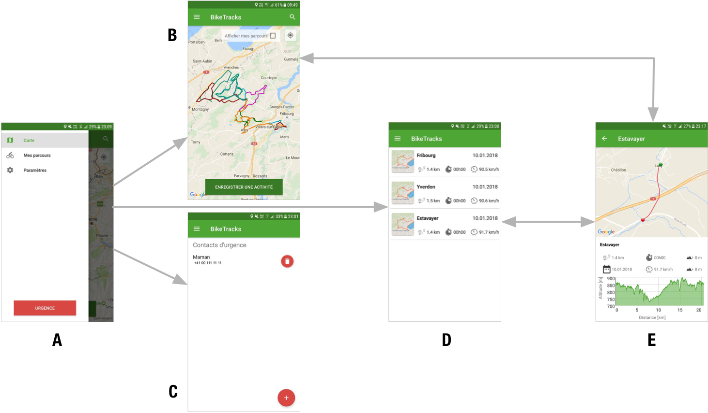

The view **A** is in fact the view **B** with the menu opened. By clicking one of the three buttons contained in it, it displays its appropriate view **B**, **C** or **D**. The view **E** is displayed by clicking an element from **D** or after recording a track from **B**. The navigation is conserved : opening **E** from **D** then clicking back returns to **D** and opening from **B** returns to **B**.

#### Technologies

The Android application was development in Java. Some frameworks and tools took part of the app to simplify its development.

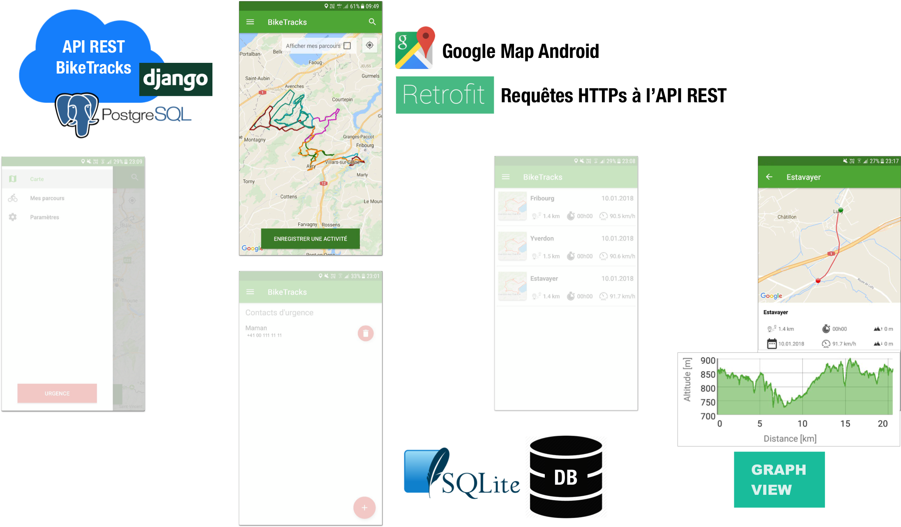

##### Java

Java is a general-purpose computer programming language that is concurrent, class-based, object-oriented, and specifically designed to have as few implementation dependencies as possible. It is intended to let application developers "write once, run anywhere" (WORA), meaning that compiled Java code can run on all platforms without the need of recompilation.


##### Android

Android is a mobile operating system developed by Google, based on the Linux kernel and designed primarily for touchscreen mobile devices such as smartphones and tablets. In addition, Google has further developed Android TV for televisions, Android Auto for cars, and Android Wear for wrist watches, each with a specialized user interface. Variants of Android are also used on game consoles, digital cameras, PCs and other electronics.


##### Google Maps API

Google Maps is a web mapping service developped by Google. It provides a very useful API for Android which can be used to display and customize maps, search for locations, display markers and lines, ...

<!-- 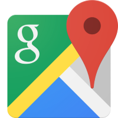 -->

##### SQLite

SQLite is an in-process library that implements a self-contained, serverless, zero-configuration, transactional SQL database engine. The code for SQLite is in the public domain and is thus free for use for any purpose, commercial or private.

<!--  -->

##### GraphView

GraphView is an open source graph plotting library for Android to programmatically create diagrams. It can be used to create Line Graphs, Bar Graphs, Point Graphs, ...

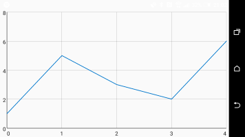

##### Retrofit

Retrofit is an open source library making the HTTP requests very easy. It handles itself the execution of a background thread to operate asynchronous API calls and as a developer, we only have to implement one callback method for success and one for failure. Retrofit also parses automatically HTTP  responses in multiple formats. For this project, only JSON format was necessary.

<!--  -->

### Languages

The application is fully translated in english and in french.

### Components

The application uses two activities : one main activity as the entry point and an activity "Detail of my track" displayed to show details of user's track.

The main activity loads three fragments depending the touched button in the menu : Map, My tracks or Settings.

- "Map" Fragment displays the tracks and their detail from the API and let user record their own activity.
- "My tracks" Fragment relates the history of tracks recorded by user.
- "Settings" Fragment is where the user sets the secure contacts.

The Fragment "Detail of my track" obviously displays the details of a track done by the user.

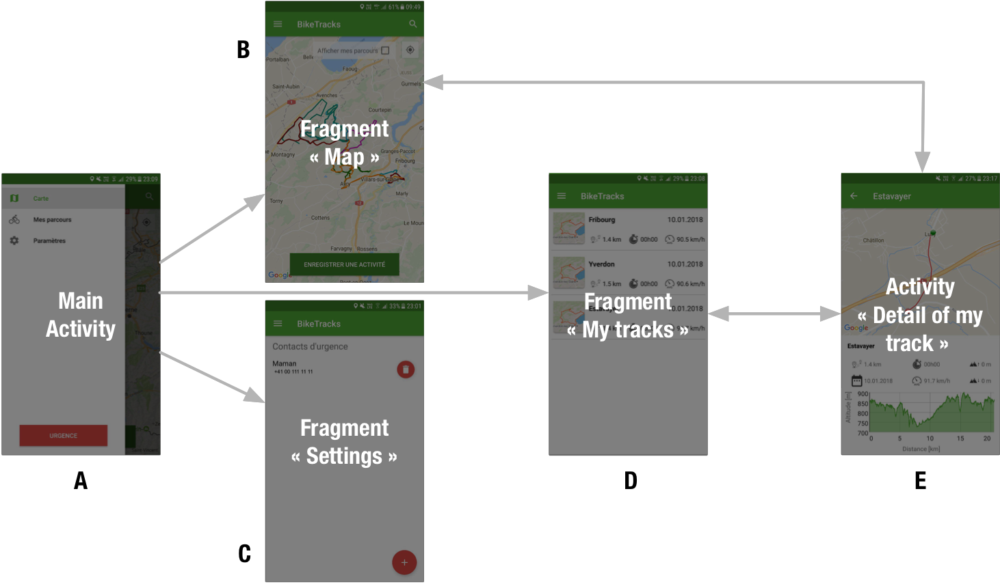

Let's focus on each component for a deeper analyze.

#### A - Main Activity

The main activity loads one of the three fragments depending the button clicked in the menu, handles also the click event on the emergency button and contains the menu bar.

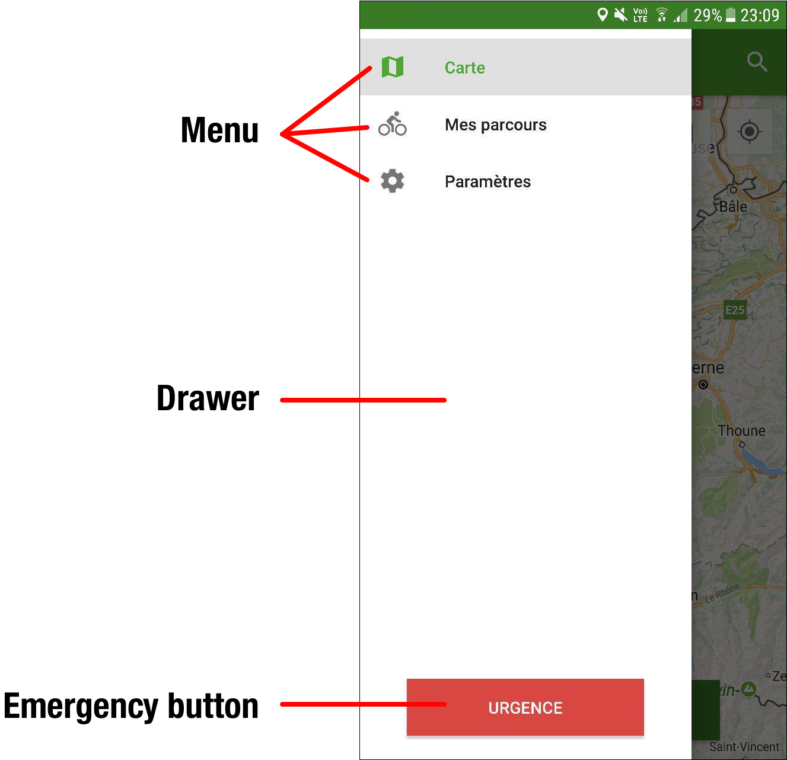

#### B - Fragment "Map"
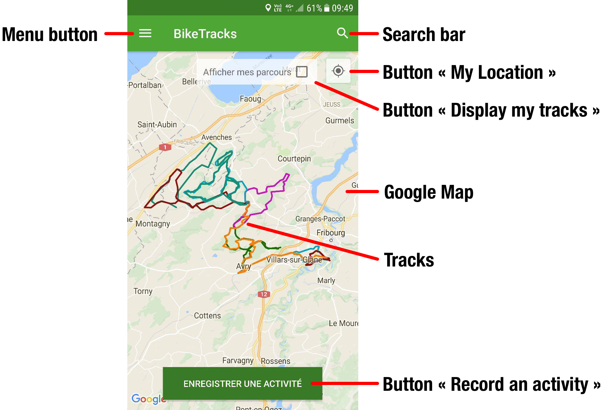
This is the main view of the application. Users can look for a specific places and discover amazing tracks. Tracks are displayed in different colors to improve visibility.

By default, only tracks received from the server are displayed. But users can choose to display they own recorded tracks, by enabling the "Display my tracks" checkbox.

This fragment also contains a location search field, to move map to a specific place. This functionnality use the Geocoder provided by Android location librairy.

#### On track selection
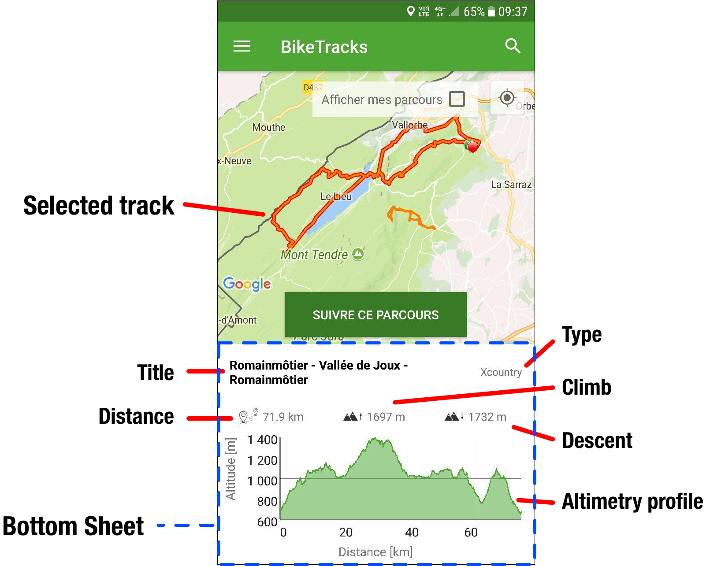

The details of the tracks are displayed inside a "Bottom Sheet", a Material Design component. In Android, this is a classic layout implementing a special behavior, the [BottomSheetBehavior](https://developer.android.com/reference/android/support/design/widget/BottomSheetBehavior.html). It must be a child of a CoordinatorLayout.

Il fact, this behavior allow to display the content in three states : hidden (not visible), collapse (partially visible) or expand (completely visible). So, the user can hide track details or reduce them.

On the map, the selected track is focused and if the user clicks on the map and outside any track, the selected track loses focus and the bottom sheet is hidden.

On this fragment, if the user clicks the "Follow" button, the selected track will remain displayed on the map during the tracking, allowing the user to follow it.

#### On recording
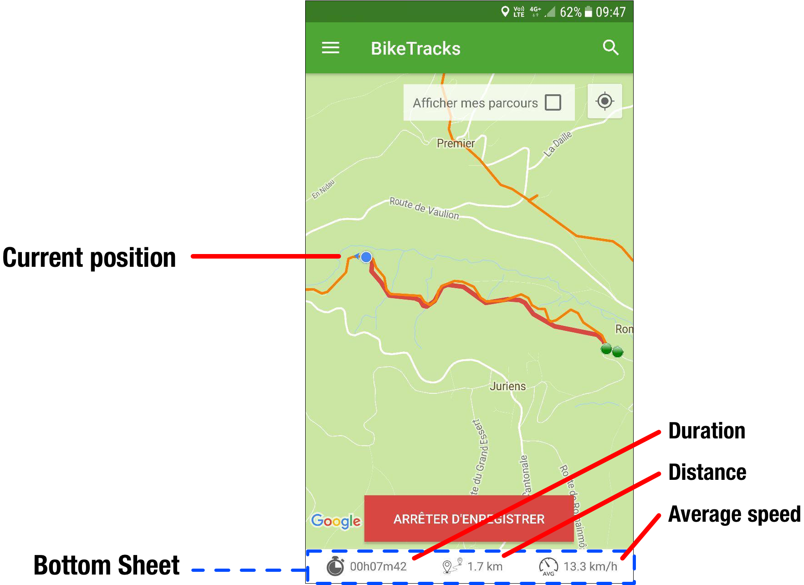

While recording, the BottomSheet is different. In fact, this is another BottomSheet, cause different contents and different behavior (no collapsed state).

Here, in background, a tracking service is recording user location changes. This is a class extending Service class. This service firstly initialize a new Track and then, each 3 seconds or 5 meters, add a new point to the track. It also compute in real time the total distance, speed average and elevation (positive and negative).
Each updates, the service locally broadcast the track, so the fragment is able to subscribe and refresh BottomSheet live information.

The service is not executed in a dedicated thread, because the only blocking operation is listening for new locations and this is already managed by the Android librairy.
The tracking stopped as soon as the service is terminated (by the fragment itself or when the application quit). Now, only one activity is listening for the track, but with the broacast, it will be possible to listen from the notification, for example, or from another activity.

While recording, users could switch of application or likely lock their screen. When the fragment is paused by the OS, the state is saved inside the bundle and the service listener is unregistered. This allows, when the fragment comes back to foreground, to automatically register the service listener and to restart displaying of the current track.

#### C - Fragment "Settings"
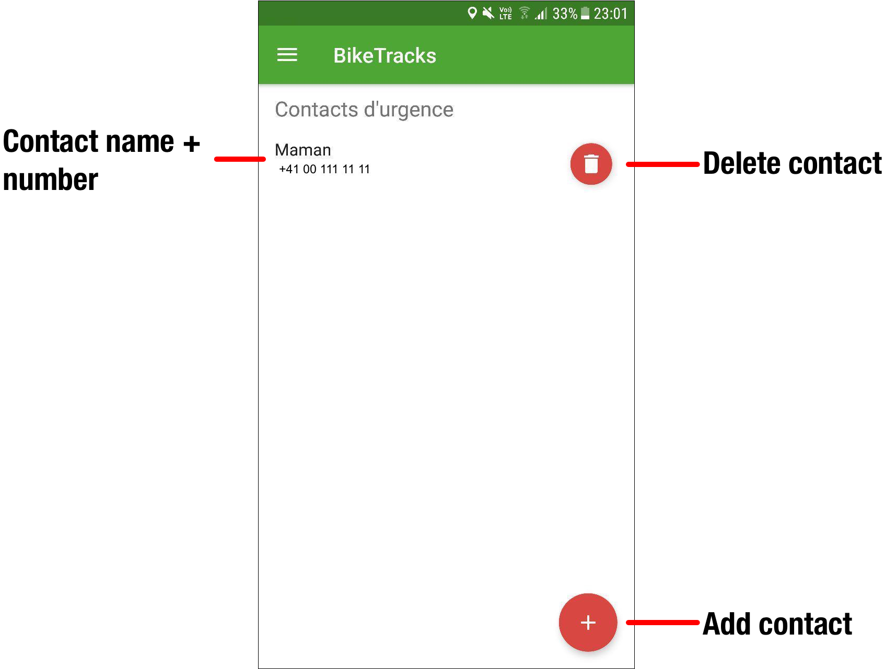

TODO - Adapter ?

#### D - Fragment "My tracks"

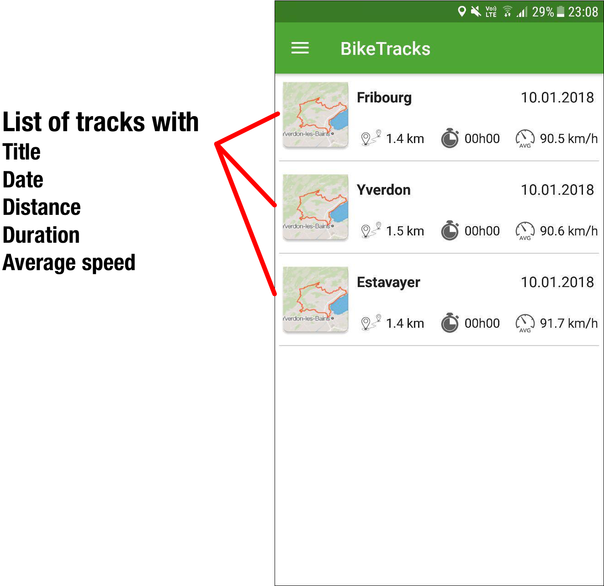

TODO - Adapter ?

#### E - Activity "Detail of my track"

TODO - Heum ? Pas d'image hahah

#### Permissions

The applications requires 4 permissions on the phone which are all checked at runtime. The drawer in the main activity must be able to send alert SMS, it requires the SEND_SMS permission. In the map fragment we use the INTERNET and ACCESS_FINE_LOCATION to access the REST API and locate the user. Finally the settings fragment needs access to the contacts on the user's phone thus it requires the READ_CONTACTS permission. In the image below we can see a summary of the different activities and the permissions they use.

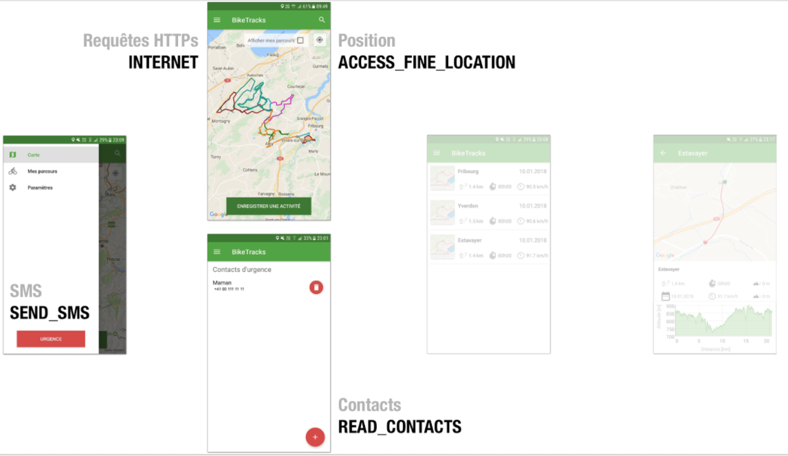

#### Notifications

We have set up a notification to notify the user when an activity is being recorded. The notification is also shown in the lock screen as we can see in the image below. We would like to add controls in the near future to allow the user to manage his activity (pause, stop...) without having to unlock his phone.

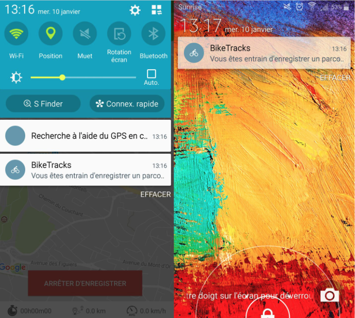

#### SMS Alert

The user can set up emergency contacts in the settings fragment. Once it's done, he can send an alert SMS in case of an accident (during the recording of an activity for example). To send the SMS alert, he must click on the Urgency button in the drawer. A confirmation will be requested to avoid unvolentary clicks. A future improvement would be to allow detection of accidents using a smartwatch and machine learning for example. The process is shown in the image below, he sends the alert, his emergency contacts receive a SMS containing the message and the location of the accident. The user can then open the link in Google Maps to show the itinary to the location.

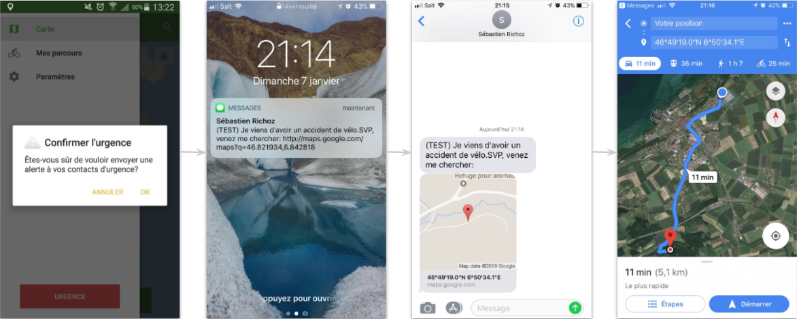

#### Structure of the code

TODO est-ce qu'on parle un peut du code, des layouts qu'on a utilisé, des adapters ou de la base de données?

#### Models and database

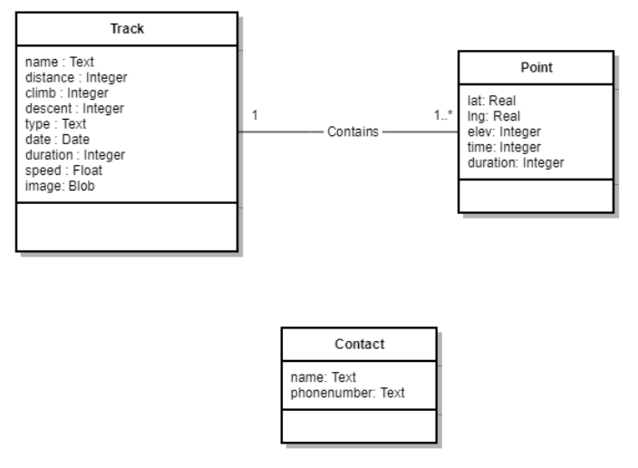


### Testing

We experiments Unit and Instrumented (interface) testing by implementing some tests.

Unit tests were executer with JUnit, which was pretty simple.
Instrumented tests were done with Espresso. They require more time for their implementation and they are slower to run because they are launched inside an Android phone emulator.

#### Deployment on the Play Store

We had the opportunities to try to deploy the application on the Google Play Store.
This has shown us that this requires some preparation.
For example, before uploading the APK, we had to fill the store application page (titles, description, screenshots, icons, etc.).
It also requires to fill forms about the content of the app, his price and his Privacy Policy.

Finally, the APK had to be signed.

The Google Play Store allow to publish the application but leaving it private.
There are two tracks : Alpha and Beta.
The Alpha versions are available on the store for the only defined persons.
The Beta versions are available to users who want to test beta apps.
During this project, we simply publish alpha versions for us.

## Difficulties encountered

### Reloading of a fragment (Google Map) with a Drawer

We have used a Drawer to access to the different fragments. It is not possible not to reload a fragment with the SupportFragmentManager. There is a method called addToBackstack but it uses a LIFO which is not what we need to access the different fragments. This is problematic because we have to reload the Google Maps map, position it at the last checked location and load all the tracks in it, each time the users access the fragment.

### GraphView doesn't support x and y axis labels

The library GraphView that we used for the graphs doesn't support x and y axis labels so we had to make it ourself with a custom layout. The y axis label must be vertical and Android doesn't support that by default so we had to find a custom vertical TextView named VerticalTextView to display the label correctly.

## Remaining bugs

## Possible improvements

Here is a list of improvements for some future release of the application:

- Show the forecast weather of the selected track as well as a heatmap and the precipitations.

- Let the user choose between different layers of map with a better altitude representation for example. We have used the Google Maps API but we would also like to try using OpenStreetMap which allows different configurations of the maps.

- Let the user download the GPX files so that he can use them in other applications.

- Make a Smartwatch version

- Add a pause command when recording a track

- Add buttons to control the recording in the notification

- Let the user send tracks to the API so that we could maybe add them to the lists of public tracks.

- Let the user store his tracks in an online database so that he can load them on another device.

- Lower the quantity of points on some of the tracks to limit the network charge for the user and diminish the response times.

## Conclusion

This project was very interesting, manipulating the Google Maps API to display our own tracks was motivating...

## Bibliography

## Annex

### Installation manual

### User guide

### REST API documentation

### Javadoc

### Source code
